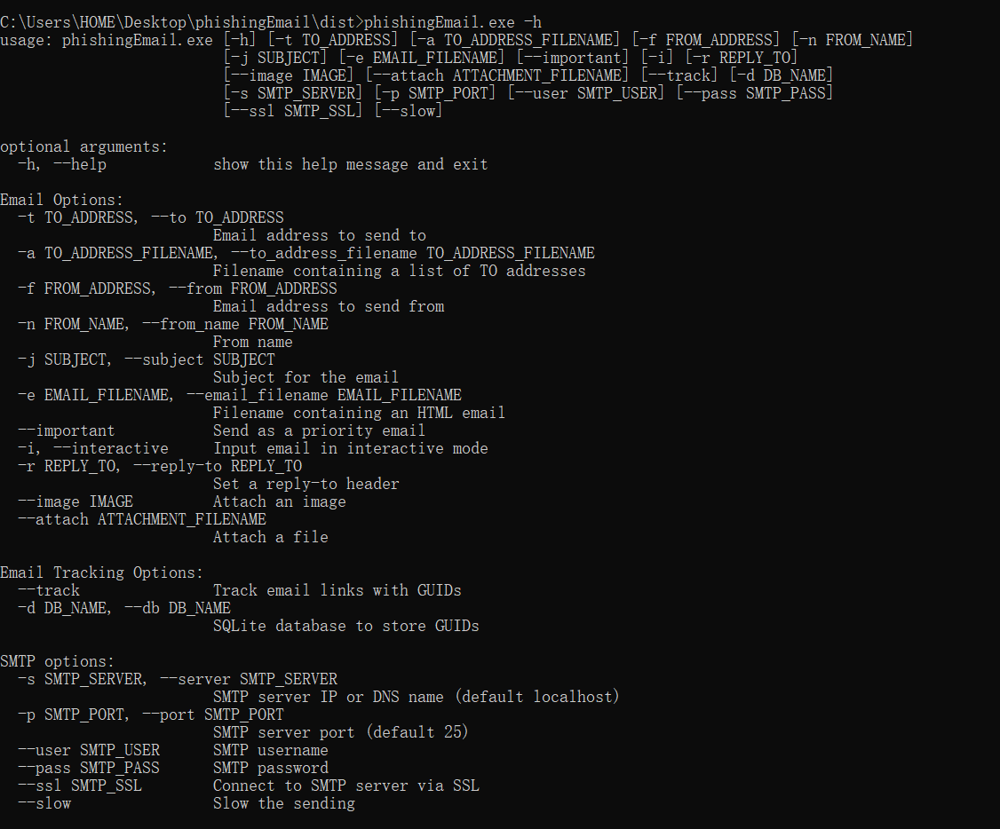

# phishingEmail 邮件发送工具

### 简介
phishingEmail 是一款命令行工具，用于测试SMTP服务器发送邮件，它的设计理念是小巧灵活易于使用，是实际运营中一款常用的全能邮件发送工具之一。
phishingEmail的优点：

    可以指定多个收件人，支持邮件批量发送；
    支持html邮件内容；
    支持附件发送；
    支持发件人伪造；
    支持无账户密码发送邮件；
    兼容性比较好，有windows exe版本；
### 参数说明
    -t 指定收件人
    -a 收件人地址文件
    -f 发送人邮箱
    -n 伪造发件人
    -j 主题
    -e 发送内容，内容为html文件
    --attach 指定附件

### 免责声明
    本工具仅面向合法授权的企业安全建设行为，如您需要测试本工具的可用性，请自行搭建靶机环境。

    在使用本工具进行检测时，您应确保该行为符合当地的法律法规，并且已经取得了足够的授权。请勿对非授权目标进行扫描和攻击。

    如您在使用本工具的过程中存在任何非法行为，您需自行承担相应后果，作者将不承担任何法律及连带责任。

    在安装并使用本工具前，请您务必审慎阅读、充分理解各条款内容，限制、免责条款或者其他涉及您重大权益的条款可能会以加粗、加下划线等形式提示您重点注意。 除非您已充分阅读、完全理解并接受本协议所有条款，否则，请您不要安装并使用本工具。您的使用行为或者您以其他任何明示或者默示方式表示接受本协议的，即视为您已阅读并同意本协议的约束。

### 安恒-星火实验室

星火实验室专注于实战攻防与研究，研究涉及实战攻防、威胁情报、攻击模拟与威胁分析等，团队成员均来自行业具备多年实战攻防经验的红队、蓝队和紫队专家。本着以攻促防的核心理念，通过落地 ATT&CK 攻防全景知识库，全面构建实战化、常态化、体系化的企业安全建设与运营。